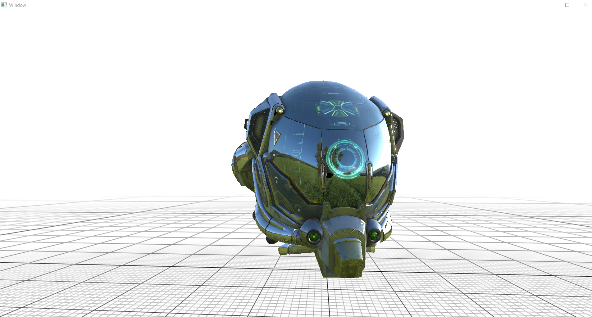
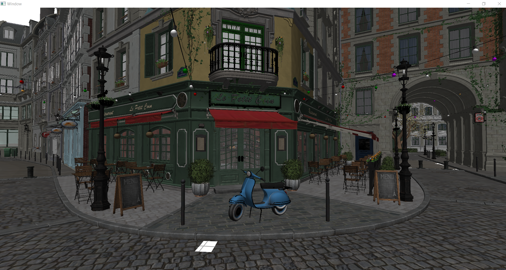
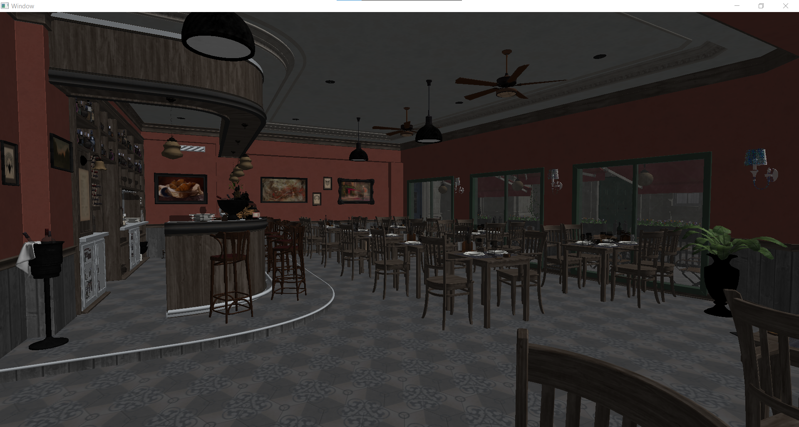

# Rendering-For-Fun

A Simple Rendering Engine written in C++17 that uses OpenGL/Vulkan as graphics API.
I'm writing this code purely for learning purposes.

# Screenshots
- Rendered In OpenGL 4.6

